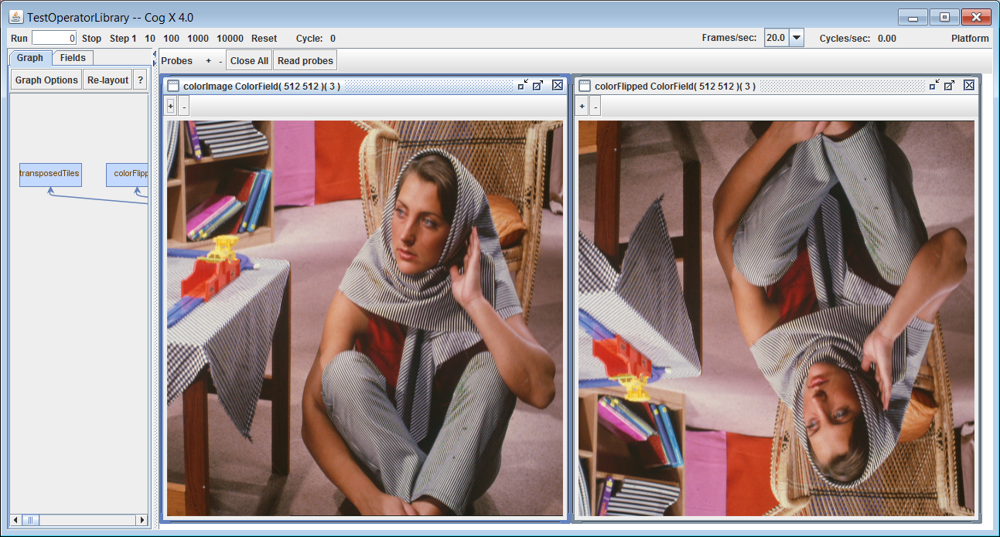
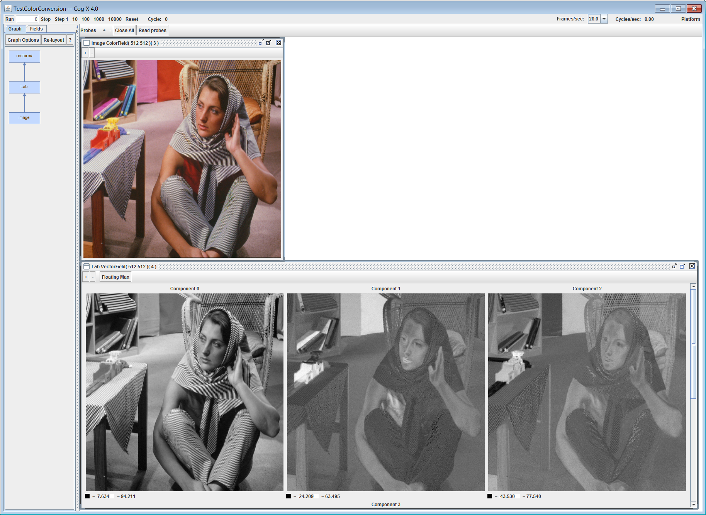

<h1>{{ page.title }}</h1>

Cog simplifies writing massively-parallel programming by compiling
high-level abstractions down to optimized GPU kernels, avoiding the
painful and laborious process of writing low-level GPU kernels in either
CUDA or OpenCL. There are, however, algorithms which cannot be expressed
using combinations of existing Cog operators, yet are parallelizable and
great candidates for implementation on a GPU. Defining such algorithms
should be: (1) simple, not requiring any knowledge of Cog internals; (2)
independent of intermediate GPU languages (such as OpenCL or CUDA); and
(3) cleanly integrated with the rest of a Cog application. This document
describes `GPUOperator`, which provides that functionality.

## Table Of Contents

*   [Overview](#overview)
*   [Programming Model](#programming-model)
     * [Single output, small tensor field operators](#single-output-small-tensor-field-operators)
     * [Multiple outputs, small tensor field operators](#multiple-outputs-small-tensor-field-operators)
     * [Big tensor field operator](#big-tensor-field-operator)
     * [Big / small tensor field operator](#big--small-tensor-field-operator)
     * [Rules for reading and writing](#rules-for-reading-and-writing)
     * [GPU threads and workgroups](#gpu-threads-and-workgroups)
*   [Variable Declarations](#variable-declarations)
*   [Constants](#constants)
*   [Vector Addressing](#vector-addressing)
*   [Operators](#operators)
*   [Built-in Functions](#built-in-functions)
     * [Integer Functions](#integer-functions)
     * [Math Functions](#math-functions)
     * [Geometric Functions](#geometric-functions)
     * [Common Functions](#common-functions)
     * [Relational Functions](#relational-functions)
     * [Atomic Functions](#atomic-functions)
     * [Vector Literal Functions](#vector-literal-functions)
     * [Type Conversion and Reinterpretation Functions](#type-conversion-and-reinterpretation-functions)
     * [Miscellaneous](#miscellaneous)
*   [Blocks](#blocks)
*   [GPU Functions](#gpu-functions)
*   [Reading and Writing Tensor Fields](#reading-and-writing-tensor-fields)
*   [Cog Primitives](#cog-primitives)
     * [Thread Allocation](#thread-allocation)
     * [Thread Organization Constants](#thread-organization-constants)
     * [Thread Identity Constants](#thread-identity-constants)
     * [Output Field Constants](#output-field-constants)
*   [Examples](#examples)
     * [Upside-Down Operator](#upside-down-operator)
     * [Local Memory Allocation](#local-memory-allocation)
     * [Color Conversion](#color-conversion)
    
## Overview

`GPUOperator` provides a high-level, domain-specific language (DSL) for
writing GPU kernels. The DSL provides most of the expressiveness of both
OpenCL and CUDA, but is constrained to operate on tensor fields.
A user-designed `GPUOperator` executes on the GPU, are potentially
optimizable (meaning that they can be merged with other GPU kernels to
minimize GPU bandwidth), and interact efficiently with other Cog code.

Because of limited registers on GPUs and limitations in the OpenCL and
CUDA languages, there are two different styles of `GPUOperator`: those
that operate on “small tensor” fields (fields with tensors containing no
more than 4 elements) and those that that operate on “big tensor” fields
(fields with tensors of more than 4 elements). The “Small tensor”
`GPUOperator` is generally the most efficient since they can be easily
optimized and fused with other `GPUOperator`'s. Small tensor fields are the
most common and include scalar fields, vector fields (with length 2, 3,
or 4 vectors), matrix fields (2 x 2 matrices) and color fields (four
components, RGBA, per tensor). The “Big tensor” `GPUOperator` is usually
less efficient, but necessary for processing the occasional big tensor
fields. We’ll show later how to write a single `GPUOperator` that can
handle both big and small tensor fields.

Here’s an example of a user-written GPU kernel that divides every
element of an input (small) tensor field by 2 and outputs the result:

    def half(input: Field): Field =
      GPUOperator(input.fieldType) { 
      _writeTensor(_out0, _readTensor(input) / 2.0f)
    }

Once defined, it can be invoked like a function:

    val s: ScalarField = ...
    val sHalf = half(s)    // Scalar field with elements divided by 2

The same function can be used on other small tensor field types as well,
even color fields, as long as the tensors are small (no more than 4
elements per tensor):

    val s: ScalarField
    val v: VectorField
    val m: MatrixField
    val c: ColorField

    val sHalf = half(s)    // Scalar field result
    val vHalf = half(v)    // Vector field result
    val mHalf = half(m)    // Matrix field result
    val cHalf = half(c)    // Color field result

The synthesized OpenCL code for the `half` `GPUOperator` applied to a 512 x
512 scalar field would look something like this:

    // OpenCL code for half GPUOperator
    __kernel void half_11(
        __global const float *_in_field_0,
        __global float *_out_field_0)
    {
        // Field parameters for _in_field_0 ScalarField( 512 512 )
        const int _in_field_0_rows = 512;
        const int _in_field_0_columns = 512;
        const int _in_field_0_tensorElements = 1;
        const int _in_field_0_layerStride  = 262144;
        const int _in_field_0_rowStride  = 512;
        const int _in_field_0_tensorStride = 0;

        // Field parameters for _out_field_0 ScalarField( 512 512 )
        const int _out_field_0_rows = 512;
        const int _out_field_0_columns = 512;
        const int _out_field_0_tensorElements = 1;
        const int _out_field_0_layerStride  = 262144;
        const int _out_field_0_rowStride  = 512;
        const int _out_field_0_tensorStride = 0;

        // Work-group-determining field parameters ScalarField( 512 512 )
        const int _rows = 512;
        const int _columns = 512;
        const int _tensorElements = 1;

        // Prolog
        const int _column = get_global_id(0);
        const int _row = get_global_id(1);
        const int _tensorElement = 0;
        int layer = 0, row = 0, column = 0, tensorElement = 0;
        if (_row >= _rows || _column >= _columns)
            return;

        // Code fragment
        float _temp_1;
        {
            _temp_1 = in_field_0[_row * _in_field_0_rowStride + _column] / 2.0f;
        }

        // Output fragment
        _out_field_0[_row * _out_field_0_rowStride + _column] = _temp_1;
    }

As you can see, the `GPUOperator` code is simpler and more abstract, and
hides the low-level boilerplate required by OpenCL. Note that this same
function can be performed more simply using the existing API:

    val sHalf = s / 2.0f

The real value of `GPUOperator`'s comes with its flexibility to handle more
complicated operations such as those requiring tiled processing.

## Programming Model

The programming model matches OpenCL and CUDA quite closely, and it’s
necessary to be familiar with at least one of those to be able to
understand the rest of this document.

### Single output, small tensor field operators

The simplest `GPUOperator` works only with “small tensor” fields, and
writes a single output tensor field. Let’s start with that by going back
to the original `half` `GPUOperator` example and dissect it:

    def half(input: Field): Field =
      GPUOperator(input.fieldType) { 
        _writeTensor(_out0, _readTensor(input) / 2.0f)
    }

The input parameter to the `GPUOperator` function is the type of the
desired output field. Here the output field is defined to be of the same
type as the input field, whatever that happens to be. This saves a lot
of time—write an operator once and use it on different field types. The
`GPUOperator` function returns the desired field.

The code segment inside the curly braces defines the action performed
*by a single thread* on the GPU. Each tensor in the output field is
given its own thread, and all threads (conceptually) can run in
parallel. For example, if the output field is a 512 x 512 vector field,
the `GPUOperator` will allocate 512 x 512 = 262,144 GPU threads to
implement the function.

The `_readTensor` function reads a single tensor from the input field.
When called with a single Field parameter like this, `_readTensor` uses
implicit addressing to determine which tensor to read. In this case it
reads the location in the input field corresponding to the location in
the output field written by the current thread.

The first argument of the `_writeTensor` function is the output field to
be written. In this case there is only one output field and the system
gives it the name `_out0`. The second argument is the tensor value to be
written. Since there are no explicit address arguments here,
`_writeTensor` also uses implicit addressing to determine where the
tensor value is to be written. The implicit addresses are the same for
both `_readTensor` and `_writeTensor`, so the half operator transforms
each tensor from the input and writes it to the corresponding location
in the output. The `_writeTensor` statement must be the last statement in
a code block; including another statement after it will generate a
compile error. (However, it is possible to include `_write` statements
within the code under certain circumstances. See section 2.5.)

Note that a leading underscore, `_`, appears on all supplied functions in
GPU operators. This prevents collisions with similar Scala keywords and
functions, and also reminds you that you are writing code that will run
on a GPU.

### Multiple outputs, small tensor field operators

A `GPUOperator` can also write multiple output fields. Here’s a simple
operator that takes one input field and writes an output field where
every element is half the input, and a second output field where every
element is double the input:

    def halfDouble(input: Field): Field =
      GPUOperator(input.fieldType, input.fieldType) { 
        val in = _tensorVar(input)
        in := _readTensor(input)
        _writeTensor(_out0, in / 2.0f)
        _writeTensor(_out1, in * 2.0f)
      }

Since we’re writing two output fields, the `GPUOperator` function here
requires two parameters specifying the types of the output fields. The
output fields are named `_out0` and `_out1`.

As before, `_writeTensor` functions are used to write the output tensors.
They may be written in any order since the first parameter describes the
field to be written. But the `_writeTensor` statements must be the last
statements in the operator body; including another statement between
them or after them will generate a compile error.

Writing multiple output fields that differ in size or tensor shape can
be done, but requires Cog primitives which have not yet been introduced.
The Examples section will show some of the idioms for doing that.

### Big tensor field operator

Although small tensor fields are most common, sometimes you’ll need to
process or generate tensor fields containing “big tensors,” where each
tensor has more than 4 elements. In that case we cannot deal with whole
tensors (because of register pressure in the GPU). Let’s start off with
an example of squaring every vector element in a “big” vector field:

    // Square every element in a big vector field

    def square(v: VectorField): VectorField =
      GPUOperator(v.fieldType) {
        _forEachTensorElement(v.tensorShape) {
          val element = _tensorElementVar(v)
          element := _readTensorElement(v)
          _writeTensorElement(_out0, element * element, _tensorElement)
        } 
      } 

The `_forEachTensorElement` statement takes a single argument: the Shape
of the big tensors to be processed. This acts like a loop, iterating on
the code within the curly braces, once for each element of the tensor.
Each iteration of the loop body defines a constant, `_tensorElement`,
which is the index of the tensor element for that iteration. Note that
`_tensorElement` is an integer; tensors are implicitly flattened in
row-major order when indexed by `_tensorElement`. The code body in this
case reads a single tensor element into the element variable, squares it
and writes the squared result to the output field. The
`_writeTensorElement` function writes to output field `_out0` with the
value element `*` element. Both functions, `_readTensorElement` and
`_writeTensorElement` use implicit addressing for both the field location
and the tensor element being written or read. Since the loop implied by
`_forEachTensorElement` runs over all tensor elements of the input and
output, the output tensor is fully specified.

There are three rules that must be followed in writing such “big tensor”
operators:

1.  The `_forEachTensorElement` statement must be the *first* statement *executed* in any given instance of a GPUOperator.
2.  No *executed* statement may follow a `_forEachTensorElement` code block.
3.  The `_readTensor` and `_writeTensor` functions are not valid in this mode and will generate compile errors if used.

### Big / small tensor field operator

Of course you would prefer to have a single square function that worked
on all tensor fields, big or small, without a user having to worry about
the tensor size. This can be done, while respecting the above three
rules, like this:

    // Square every element in a BIG OR SMALL vector field

    def square(v: VectorField): VectorField =
      GPUOperator(v.fieldType) {
        if (isBigTensor(v.fieldType.tensorShape)) {
          // Big tensor kernel
          _forEachTensorElement(v.tensorShape) {
            val element = _tensorElementVar(v)
            element := _readTensorElement(v, _tensorElement))
            _writeTensorElement(_out0, element * element, _tensorElement)
          }
        } else {
          // Small tensor kernel
          val tensor = _tensorVar(v)
          tensor := _readTensor(v)
          _writeTensor(_out0, tensor * tensor)
        } 
      }

The `if (isBigTensor…)` code runs in Scala, not on the GPU, so it does
not count as an *executable* statement on the GPU. The `square` operator
above will generate one of two very different GPU kernels, depending on
the size of the tensors in the input field. This tactic allows you to
create general-purpose `GPUOperator`'s that work for all tensor sizes.

### Rules for reading and writing

The following table summarizes the legal `_read` and `_write` operations
for both small tensor and big tensor addressing:

| Operation | small tensor | big tensor | comment |
| --- | :---: | :---: | :---: |
| `_readTensor(f, …)`  | OK  | ILLEGAL | |
| `_readTensorElement(f, …)`  | OK  | OK | |
| `_writeTensor(f, …)`  | OK  | ILLEGAL | Must be last executable statement. |
| `_writeTensorElement(f, …)`  | OK  | OK | |

Here are general guidelines for writing efficient GPU operators:

1. Small tensor operators are generally more efficient than big tensor operators.
2. *Non-local* writes and reads of any kind preclude kernel fusion, possibly resulting in lower performance. Avoid them if possible:

       _writeTensor(_out0, value)              // local, efficient 
       _readTensor(field)                      // local, efficient
       _writeTensor(_out0, value, row, column) // nonlocal, less efficient
       _readTensor(field, row, column)         // nonlocal, less efficient
      
3. The most efficient operator is a small tensor operator with a single `_writeTensor()` function call as its final statement.
4. It is legal to process big tensor fields in small tensor operators using `_readTensorElement()` and `_writeTensorElement()` functions.

### GPU threads and workgroups

Most of the time you will not have to worry about how threads and
“workgroups” (collections of threads, called “blocks” in CUDA) are
structured on the GPU. Cog uses its own default values for workgroup
sizes to maximize kernel fusion to improve performance. Some operations,
though, such as reductions, require explicit thread allocation. This
will be covered in a later [section](#thread-allocation).

## Variable Declarations

Variables in GPU kernels are created with functions and assigned to Scala `val`'s. For example, the following code

`val x = _floatVar()`

declares a float variable, initialized to zero, in the GPU kernel. It will generate OpenCL code equivalent to:

`float x = 0.0f;`

Scalars for other scalar types are declared in the same way. The following scalar and vector variable declarations are supported:

| Scalar type | Vector type (n = 2, 3, 4) | Description |
| --- | --- | --- |
| `_boolVar()`  |  | true(1) or false(0) |
`_charVar()` | `char`*n*`Var()` | 8-bit signed
`_ucharVar()` | `_uchar`*n*`Var()` | 8-bit unsigned
`_shortVar()` | `_short`*n*`Var()` | 16-bit signed
`_ushortVar()` | `_ushort`*n*`Var()` | 16-bit unsigned
`_intVar()`   | `_int`*n*`Var()`  | 32-bit signed
`_uintVar()` | `_uint`*n*`Var()` |  32-bit unsigned
`_longVar()` | `_long`*n*`Var()` | 64-bit signed
`_ulongVar()` | `_ulong`*n*`Var()` | 64-bit unsigned
`_floatVar()` | `_float`*n*`Var()` | 32-bit floating point
`_doubleVar()` | `_double`*n*`Var()` | 64-bit floating point (not supported on all platforms)

Thread-local arrays of scalar types can be declared by replacing `var`
with `Array(dimensions)` for any of the scalar or vector types listed
above. Arrays are limited to 1, 2 or 3 dimensions. Some examples:

    val a = _float2Array(5) // 1D array of float2s 
    val b = _intArray(4, 4) // 2D array of ints

Local memory, shared by threads in a work group, is declared by using
the `_local` function on the variable or array declaration:

    val a = _local(_floatArray(5)) // 1D array of floats, shared by work group 
    val b = _local(_int4Array(4, 4)) // 2D array of int4s, shared by work group

Variables and arrays may be declared to match the type of tensors in a
specific input field:
 
     val a = _tensorVar(field) // A tensor of the type found in field 
     val b = _tensorArray(field, 4, 4) // 2D array of tensors 
     val c = _local(_tensorVar(field)) // Shared tensor 
     val d = _local(_tensorArray(field, 4, 4)) // Shared tensor array   

Variables and arrays may also be declared to match the type of tensor
*element* in a specific input field. Currently only `float` elements are
supported, but this may be extended if and when CogX supports generic
fields:

     val a = _tensorElementVar(field) // An element found in fields 
     val b = _tensorElementArray(field, 4, 4) // 2D array of elements 
     val c = _local(_tensorElementVar(field)) // Shared element 
     val d = _local(_tensorElementArray(field, 4, 4)) // Shared element array

## Constants

`Int` and `float` constants are written using the Scala convention, e.g. `1`
or `2.3f`. Other fundamental types, such double or short, are not yet
supported.

## Vector Addressing

OpenCL uses method “swizzling,” duplication and nesting to offer an
enormous number of methods (not functions) for accessing vector
components. They all have the form:

    vectorExpression.componentExpression

where componentExpression is something like x or xy. Some examples:

See the OpenCL 1.1 Specification for details. Find it [here](https://www.khronos.org/opencl/). `GPUOperator`'s support the
following vector component methods:

>**x y z w**

>**xx xy xz xw yx yy yz yw zx zy zz zw wx wy wz ww**

>**xxx xxy xxz xxw yxx yxy yxz yxw zxx zxy zxz zxw wxx wxy wxz wxw**

>**xyx xyy xyz xyw yyx yyy yyz yyw zyx zyy zyz zyw wyx wyy wyz wyw**

>**xzx xzy xzz xzw yzx yzy yzz yzw zzx zzy zzz zzw wzx wzy wzz wzw**

>**xwx xwy xwz xww ywx ywy ywz yww zwx zwy zwz zww wwx wwy wwz www**
    
Cog uses an RGBA format for color fields, thus

    pixel.x -> red channel
    pixel.y -> green channel
    pixel.z -> blue channel
    pixel.w -> alpha channel

These vector methods can only be used for reading vector components, not
writing them.

## Array Addressing

Arrays are read using Scala `apply(indices)`. Arrays are written using the
`:=` operator:

    val b = _local(_floatArray(4, 4)) // 2D array of floats, shared by work group
    val c = b(0, 2)                   // Read ELEMENT [0][2] of b
    b(0, 2) := 2.0f                   // Write element [0][2] of b with value 2.0f

## Operators

The usual C99 operators on scalars and vectors (where possible) are
supported. To avoid conflicts with Scala, **the** `=` **operator is
replaced by the** `:=` **operator, the** `==` **operator is replaced by
the** `===` **operator, and the** `!=` **operator is replaced by the** `!==`
**operator**. Here are the supported operators:

    +      -      *      %      /      op=      :=      ===      !==      &      ~      ^
    >      <      >=     <=     |       !       &&      ||       <<     >>                    

Here’s an example of using the operators:

    val a = _floatVar()
    a := 3.4f
    val b = _floatVar()
    b := a + 1f

The above would generate OpenCL code equivalent to:

    float a = 0.0f; 
    a = 3.4f; 
    float b = 0.0f; 
    b = a + 1.0f;

## Built-in Functions

Most of the functions from the OpenCL 1.1 Quick Reference Card are
supported. See [http://www.khronos.org/files/opencl-1-1-quick-reference-card.pdf](http://www.khronos.org/files/opencl-1-1-quick-reference-card.pdf).

### Integer Functions

T is type `char`, `char`*n*, `uchar`, `uchar`*n*, `short`, `short`*n*, `ushort`, `ushort`*n*,
`int`, `int`*n*, `uint`, `uint`*n*, `long`, `long`*n*, `ulong`, or `ulong`*n*, where n is 2, 3,
or 4. U is the unsigned version of T. S is the scalar version of T.

| Integer Functions | Description |
| --- | --- |
|  `U _abs (T x)`  |                  \|x\|   |
|  `U _abs_diff (T x, T y)`  |       \| x – y \| without modulo overflow |
|  `T _add_sat (T x, T y)`  |        x + y and saturates the result  |
|  `T _hadd (T x, T y)`  |           (x + y) >> 1 without mod. overflow |
|  `T _rhadd (T x, T y)`  |          (x + y + 1) >> 1 |
|  `T _clz (T x)`  |                 Number of leading 0-bits in x |
|  `T _clamp (T x, T min, T max)` |  min(max(x, minval), maxval) |
|  `T _clamp (T x, S min, S max)` |  min(max(x, minval), maxval) |
|  `T _mad_hi (T a, T b, T c)`  |   mul_hi(a, b) + c |
|  `T _mad_sat (T a, T b, T c)` |   a \* b + c and saturates the result |
|  `T _max (T x, T y)`  |            y if x < y, otherwise it returns x |
|  `T _max (T x, S y)`  |            y if x < y, otherwise it returns x |
|  `T _min (T x, T y)`  |            y if y < x, otherwise it returns x |
|  `T _min (T x, S y)`  |            y if y < x, otherwise it returns x |
|  `T _mul_hi (T x, T y)`  |         high half of the product of x and y |
|  `T _rotate (T v, T i)`  |         result\[index\] = v\[index\] << i\[index\] |
|  `T _sub_sat (T x, T y)`  |        x - y and saturates the result |
|  `T _mad24 (T a, T b, T c)`  |     Multiply 24-bit int. values a, b, add 32-bit int. result to 32-bit int. c |
|  `T _mul24 (T a, T b)`  |          Multiply 24-bit int. values a and b |

Example:

    val a = _intVar()
    a := -5
    val aAbs = _intVar()
    aAbs := _abs(a) 

### Math Functions

T is type `float` or `float`*n* (or optionally `double`, `double`*n*, or `half`*n*).
`int`*n*, `uint`*n*, and `ulong`*n* must be scalar when T is scalar.

| Math Functions | Description |
| --- | --- |
|  `T _acos (T)` |                          Arc cosine
|  `T _acosh (T)` |                         Inverse hyperbolic cosine
|  `T _acospi (T x)` |                      acos (x) / π
|  `T _asin (T)` |                          Arc sine
|  `T _asinh (T)` |                         Inverse hyperbolic sine
|  `T _asinpi (T x)` |                      asin (x) / π
|  `T _atan (T x)` |                        Arc tangent
|  `T _atan2 (T y, T x)` |                  Arc tangent of y / x
|  `T _atanh (T)` |                         Hyperbolic arc tangent
|  `T _atanpi (T x)` |                      atan (x) / π
|  `T _atan2pi (T x, T y)` |                atan2 (x, y) / π
|  `T _cbrt (T)` |                          Cube root
|  `T _ceil (T)` |                          Round to integer toward + infinity
|  `T _copysign (T x, T y)` |               x with sign changed to sign of y
|  `T _cos (T)` |                           Cosine
|  `T _cosh (T)` |                          Hyperbolic cosine
|  `T _cospi (T x)` |                       cos (π x)
|  `T _native_divide (T x, T y)` |         
|  `T _erfc (T)` |                          Complementary error function
|  `T _erf (T)` |                           Calculates error function of T
|  `T _exp (T x)` |                         Exponential base e
|  `T _exp2 (T)` |                          Exponential base 2
|  `T _exp10 (T)` |                         Exponential base 10
|  `T _expm1 (T x)` |                       e^x -1.0
|  `T _fabs (T)` |                          Absolute value
|  `T _fdim (T x, T y)` |                   “Positive difference” between x and y
|  `T _floor (T)` |                         Round to integer toward - infinity
|  `T _fma (T a, T b, T c)` |               Multiply and add, then round
|  `T _fmax (T x, T y)` |                   Return y if x &lt; y, otherwise it returns x
|  `T _fmin (T x, T y)` |                   Return y if y &lt; x, otherwise it returns x
|  `T _fmod (T x, T y)` |                   Modulus. Returns x – y * truncate (x/y)
|  `T _hypot (T x, T y)` |                  Square root of x^2+ y^2
|  `intn _ilogb (T x)` |                    Return exponent as an integer value
|  `T _ldexp (T x, intn n)` |               x * 2^n
|  `T _ldexp (T x, int n)` |                x * 2^n
|  `T _lgamma (T x)` |                      Log gamma function
|  `T _lgamma_r (T x, Q intn *signp)`  |   Log gamma function
|  `T _log (T)` |                           Natural logarithm
|  `T _log2 (T)` |                          Base 2 logarithm
|  `T _log10 (T)` |                         Base 10 logarithm
|  `T _log1p (T x)` |                       ln (1.0 + x)
|  `T _logb (T x)` |                        Exponent of x
|  `T _mad (T a, T b, T c)` |               Approximates a \* b + c
|  `T __maxmag (T x, T y)` |                Maximum magnitude of x and y
|  `T _minmag (T x, T y)` |                 Minimum magnitude of x and y
|  `float _nan (uintn nancode)` |           Quiet NaN
|  `floatn _nan (uintn nancode)` |          Quiet NaN
|  `halfn _nan (ushortn nancode)` |         Quiet NaN
|  `doublen _nan (ulongn nancode)` |        Quiet NaN
|  `T _nextafter (T x, T y)` |              Next representable floating-point value following x in the direction of y
|  `T _pow (T x, T y)` |                    Compute x to the power of y (x^y)
|  `T _pown (T x, intn y)` |                Compute x^y, where y is an integer
|  `T _powr (T x, T y)` |                   Compute x^y, where x is >= 0
|  `T _remainder (T x, T y)` |              Floating point remainder
|  `T _remquo (T x, T y, Q intn *quo)` |    Floating point remainder and quotient
|  `T _rint (T)` |                          Round to nearest even integer
|  `T _rootn (T x, intn y)` |               Compute x to the power of 1/y
|  `T _round (T x)` |                       Integral value nearest to x rounding
|  `T _rsqrt (T)` |                         Inverse square root
|  `T _sin (T)` |                           Sine
|  `T _sinh (T)` |                          Hyperbolic sine
|  `T _sinpi (T x)` |                       sin (π x)
|  `T _sqrt (T)` |                          Square root
|  `T _tan (T)` |                           Tangent
|  `T _tanh (T)` |                          Hyperbolic tangent
|  `T _tanpi (T x)` |                       tan (π x)
|  `T _tgamma (T)` |                        Gamma function
|  `T _trunc (T)` |                         Round to integer toward zero

### Geometric Functions

Vector types may have 2, 3, or 4 components. Optional extensions enable
`double`, `double`*n* types.

| Geometric Functions | Description |
| --- | --- |
| `float _dot (float p0, float p1)`  `float _dot (floatn p0, floatn p1)`   `double _dot (double p0, double p1)`   `double _dot (doublen p0, doublen p1)`| Dot product                       
| `float{3,4} _cross (float{3,4} p0, float{3,4} p1)`   `double{3,4} _cross (double{3,4} p0, double{3,4} p1)` | Cross product
| `float _distance (float p0, float p1)`   `float _distance (floatn p0, floatn p1)`   `double _distance (double p0, double p1)`   `double _distance (doublen p0, doublen p1)`     |  Vector distance        
| `float _length (float p)`   `float _length (floatn p)`   `double _length (double p)`   `double _length (doublen p)` | Vector length                   
| `float _normalize (float p)`   `floatn _normalize (floatn p)`   `double _normalize (double p)`   `doublen _normalize (doublen p)` | Normal vector length 1                       
| `float _fast_distance (float p0, float p1)`   `float _fast_distance (floatn p0, floatn p1)` | Vector distance   
| `float _fast_length (float p)`   `float _fast_length (floatn p)` | Vector length                      
| `float _fast_normalize (float p)`   `floatn _fast_normalize (floatn p)` | Normal vector length 1                

### Common Functions

T is type `float` or `float`*n*:

| Common Functions | Description |
| --- | --- |
| `T _clamp(T x, T min, T max)`   `floatn _clamp(floatn x, float min, float max)` | Clamp x to range given by min, max
| `T _degrees(T radians)` | Radians to degrees
| `T _max(T x, T y)`   `floatn _max(floatn x, float y)` | Max of x and y                  
| `T min(T x, T y)`   `floatn _min(floatn x, float y)` | Min of x and y                 
|  `T mix(T x, T y, T a)`   `floatn _mix(floatn x, float y, float a)` |  Linear blend of x and y        
| `T _radians(T degrees)` | Degrees to radians
| `T sign(T x)` | Sign of x

### Relational Functions

T is type `float`, `float`*n*, `char`, `char`*n*, `uchar`, `uchar`*n*, `short`, `short`*n*,
`ushort`, `ushort`*n*, `int`, `int`*n*, `uint`, `uint`*n*, `long`, `long`*n*, `ulong`, or `ulong`*n*
(and optionally `double`, `double`*n*). S is type `char`, `char`*n*, `short`, `short`*n*,
`int`, `int`*n*, `long`, or `long`*n*. U is type `uchar`, `uchar`*n*, `ushort`, `ushort`*n*,
`uint`, `uint`*n*, `ulong`, or `ulong`*n*. Optional extensions enable `double`,
`double`*n*.

| Relational Functions | Description |
| --- | --- |
| `int \_isequal (float x, float y)`   `intn _isequal (floatn x, floatn y)`   `int _isequal (double x, double y)`       `longn _isequal (doublen x, doublen y)` | Compare of x == y  
| `int _isnotequal (float x, float y)`   `intn _isnotequal (floatn x, floatn y)`   `int _isnotequal (double x, double y)`   `longn _isnotequal (doublen x, doublen y)` | Compare of x != y       
| `int _isgreater (float x, float y)`   `intn _isgreater (floatn x, floatn y)`   `int _isgreater (double x, double y)`     `longn _isgreater (doublen x, doublen y)` | Compare of x > y              
| `int _isgreaterequal (float x, float y)`   `intn _isgreaterequal (floatn x, floatn y)`   `int _isgreaterequal (double x, double y)`   `longn _isgreaterequal (doublen x, doublen y)` |Compare of x >= y  
| `int _isless (float x, float y)`   `intn _isless (floatn x, floatn y)`   `int _isless (double x, double y)`   `longn _isless (doublen x, doublen y)` | Compare of x < y           
| `int _islessequal (float x, float y)`   `intn _islessequal (floatn x, floatn y)`   `int _islessequal (double x, double y)`   `longn _islessequal (doublen x, doublen y)` | Compare of x <= y      
| `int _islessgreater (float x, float y)`    `intn _islessgreater (floatn x, floatn y)`    `int _islessgreater (double x, double y)`    `longn _islessgreater (doublen x, doublen y)` | Compare of (x < y) \|\| (x > y)
| `int _isfinite (float)`   `intn _isfinite (floatn)`   `int _isfinite (double)`   `longn _isfinite (doublen)` | Test for finite value                              
| `int _isinf (float)`   `intn _isinf (floatn)`   `int _isinf (double)`    `longn _isinf (doublen)` | Test for +ve or –ve infinity                                
| `int _isnan (float)`   `intn _isnan (floatn)`   `int _isnan (double)`   `longn _isnan (doublen)` | Test for a NaN        
| `int _isnormal (float)`   `intn _isnormal (floatn)`   `int _isnormal (double)`   `longn _isnormal (doublen)` | Test for a normal value 
| `int _isordered (float x, float y)`   `intn _isordered (floatn x, floatn y)`   `int _isordered (double x, double y)`     `longn _isordered (doublen x, doublen y)` | Test if arguments are ordered                
| `int _isunordered (float x, float y)`   `intn _isunordered (floatn x, floatn y)`   `int _isunordered (double x, double y)`   `longn _isunordered (doublen x, doublen y)` | Test if arguments are unordered             
| `int _signbit (float)`   `intn _signbit (floatn)`   `int _signbit (double)`   `longn _signbit (doublen)` | Test for sign bit    
| `int _any (S x)` | 1 if MSB in any component of `x` is set; else 0
| `int _all (S x)` | 1 if MSB in all components of `x` are set; else 0
| `T _bitselect (T a, T b, T c)`   `doublen _bitselect (doublen a, doublen b, doublen c)` | Each bit of result is corresponding bit of `a` if corresponding bit of `c` is 0 
| `T _select (T a, T b, S c)`   `T _select (T a, T b, U c)`   `doublen _select (doublen, doublen, longn)`   `doublen _select (doublen, doublen, ulongn)` | For each component of a vector type, result\[i\] = if MSB of c\[i\] is set ? b\[i\] : a\[i\]. For scalar type, result = c ? b : a  

### Atomic Functions

T is either `int` or `uint`. The first argument is a pointer to a `volatile`
variable or `volatile __local` variable or array element (Q = `volatile
__local`). The `_local(variable)` and `_volatile(variable)` functions can
be used to annotate the declaration of a variable (scalar, vector, or
array). The pointer value can be obtained using the
`_pointerTo(variable)` function. Note that these are functions, not
procedures, and the return value *must* be written to a variable even if
it will not be used later in the code.

| Atomic Functions | Description |
| --- | --- |
| `T _atomic_add(Q T *p, T val)` | Read, add, and store
| `T _atomic_sub(Q T *p, T val)` |               Read, subtract, and store
| `T _atomic_xchg(Q T *p, T val)` |              Read, swap, and store
| `T _atomic_inc(Q T *p)` |                      Read, increment, and store
| `T _atomic_dec(Q T *p)` |                      Read, decrement, and store
| `T _atomic_compxchg(Q T *p, T cmp, T val)` |   Read and store (\*p == cmp) ? val : \*p
| `T _atomic_min(Q T *p, T val)` |               Read, store min(\*p, val)
| `T _atomic_max(Q T *p, T val)` |               Read, store max(\*p, val)
| `T _atomic_and(Q T *p, T val)` |               Read, store (\*p & val)
| `T _atomic_or(Q T *p, T val)` |                Read, store (\*p \| val)
| `T _atomic_xor(Q T *p, T val)` |               Read, store (\*p ^ val)

Here are examples of declaring memory suitable for the first parameter
to the above functions:
  
    val a = _volatile(_intVar()) 
    val b = _volatile(_local(intVar())) 
    val c = _volatile(_local(intArray(5, 5)))

And here’s how to obtain the pointer for the first parameter:

    x := atomic_inc(_pointerTo(a)) 
    y := atomic_inc(_pointerTo(b)) 
    z := atomic_inc(_pointerTo(c(2, 3)))    

### Vector Literal Functions

These functions create vector expressions from mixed scalar/vector
expressions. The arguments can be a mixture of scalars and vectors, but
the total number of components in the arguments must equal the number of
components in the result. An exception: if there is only one scalar
argument, it will be replicated as necessary to create the result.

| Vector Literal Functions | Description |
| --- | --- |
| `float2 _float2(e1)`              | Convert expression `e1` to `float2`
| `float2 _float2(e1, e2)`          | Convert expressions `e1`, `e2` to `float2`
| `float3 _float3(e1)`              | Convert expressions `e1` to `float3`
| `float3 _float3(e1, e2)`          | Convert expressions `e1`, `e2` to `float3`
| `float3 _float3(e1, e2, e3)`      | Convert expressions `e1`, `e2`, `e3` to `float3`
| `float4 _float4(e1)`              | Convert expression `e1` to `float4`
| `float4 _float4(e1, e2)`          | Convert expressions `e1`, `e2` to `float4`
| `float4 _float4(e1, e2, e3)`      | Convert expressions `e1`, `e2`, `e3` to `float4`
| `float4 _float4(e1, e2, e3, e4)`  | Convert expressions `e1`, `e2`, `e3`, `e4` to `float4`
| `int2 _int2(e1)`                  | Convert expression `e1` to `int2`
| `int2 _int2(e1, e2)`              | Convert expressions `e1`, `e2` to `int2`
| `int3 _int3(e1)`                  | Convert expressions `e1` to `int3`
| `int3 _int3(e1, e2)`              | Convert expressions `e1`, `e2` to `int3`
| `int3 _int3(e1, e2, e3)`          | Convert expressions `e1`, `e2`, `e3` to `int3`
| `int4 _int4(e1)`                  | Convert expression `e1` to `int4`
| `int4 _int4(e1, e2)`              | Convert expressions `e1`, `e2` to `int4`
| `int2 _int4(e1)`                  | Convert expressions `e1`, `e2`, `e3` to `int4`
| `int2 _int4(e1, e2)`              | Convert expressions `e1`, `e2`, `e3`, `e4` to `int4`

### Type Conversion and Reinterpretation Functions

These functions convert or reinterpret expressions of one type to
another type:

| Type Conversion and Reinterpretation Functions | Description |
| --- | --- |
| `float _convert_float(e)` |     Convert `e` to `float`
| `float2 _convert_float2(e)` |   Convert `e` to `float2`
| `float3 _convert_float3(e)` |   Convert `e` to `float3`
| `float4 _convert_float4(e)` |   Convert `e` to `float4`
| `int _convert_int(e)` |         Convert `e` to `int`
| `int2 _convert_int2(e)` |       Convert `e` to `int2`
| `int3 _convert_int3(e)` |       Convert `e` to `int3`
| `int4 _convert_int4(e)` |       Convert `e` to `int4`
| `float _as_float(e)` |          Reinterpret `e` as `float`
| `float _as_float2(e)` |         Reinterpret `e` as `float2`
| `float _as_float3(e)` |         Reinterpret `e` as `float3`
| `float _as_float4(e)` |         Reinterpret `e` as `float4`
| `float _as_int(e)` |            Reinterpret `e` as `int`
| `float _as_int2(e)` |           Reinterpret `e` as `int2`
| `float _as_int3(e)` |           Reinterpret `e` as `int3`
| `float _as_int4(e)` |           Reinterpret `e` as `int4`
| `float _as_uint(e)` |           Reinterpret `e` as `uint`
| `float _as_uint2(e)` |          Reinterpret `e` as `uint2`
| `float _as_uint3(e)` |          Reinterpret `e` as `uint3`
| `float _as_uint4(e)` |          Reinterpret `e` as `uint4`

### Miscellaneous

| Miscellaneous Functions | Description |
| --- | --- |
| `_syncThreadsLocal` |      Barrier synchronization of work group with respect to local memory reads and writes. Note that no parentheses are used (this is a statement, not a function).
| `_syncThreadsGlobal` |    Barrier synchronization of work group with respect to global memory reads and writes. Note that no parentheses are used (this is a statement, not a function).
| `_local(variable)` |       Annotate variable as local and return annotated variable.
| `_volatile(variable)` |    Annotate variable as volatile and return annotated variable.
| `_pointerTo(variable)` |   Get pointer to a variable or array element. Useful only for the atomic functions.
| `isBigTensor(Shape)` |      Returns true if the specified shape (assumed to be a tensor shape) is a “big tensor.”

## Blocks

Three types of blocks are supported: *for* loops, *while* loops, and
*if* (*else*) blocks.

*For* loops look like this:
      
      val i = _intVar()
      _for (i := 0, i < 5, i += 1) { 
        // do work here 
      }

The curly braces are required for the loop body, even if it only
contains one line. Note that `_for` is a function call, so the three
arguments are separated by commas, not semicolons.

*While* loops follow the same pattern:

    _while (x >= 0.0f) { 
      // do work here 
    }
    
A simple *if* block looks like this:

    _if (x < 4) { 
      // do work here 
    }

An *if / else* block looks like this:

    _if (x < 4) { 
      // do work here 
    } 
    _else { 
      // do work here 
    }

Chains of *if*, *else if*, *else if*, are done like this:

    _if (x < 1) { 
      // do work here 
    } 
    _elseif (x < 2) { 
      // do work here 
    } 
    _elseif (x < 3) { 
      // do work here 
    } 
    _else { 
      // do work here 
    }

These can also be written more compactly:

    _if (x < 4) { y := 0 } 
    _elseif (x > 5) { y := 1 } 
    _else { y := 2 }

But the closing `}` must be followed by a newline (or comment) in every
case.

## GPU Functions

`GPUOperator`'s can also be built using smaller, reusable *GPU functions*.
Such functions are just Scala functions that return one of three GPU
types:

| GPU Functions | Description |
|---|---|
| `GPUVariable` |        A scalar or vector variable on the GPU.
| `GPUArrayVariable` |   An array variable on the GPU.
| `GPUExpression` |      A scalar or vector value on the GPU.

Here’s a function that creates and returns a vector variable:

    def createMyInt4Variable(): GPUVariable = 
      _int4Var()

Here’s a slightly more useful one that creates and returns a 2D
volatile, local array:

    def createLocalArray(rows: Int, columns: Int): GPUArrayVariable = 
      _volatile(_local(_floatArray(rows, columns)))

Here’s one that computes the average of two values and returns it:

    def average(e1: GPUExpression, e2: GPUExpression): GPUExpression = 
      (e1 + e2) / 2.0f

GPU functions allow for more modular algorithm design, but they do not
offer any performance benefits. GPU compilers inline all functions
anyway, so ultimately a `GPUOperator` gets compiled down to a single GPU
kernel that makes no function calls.

## Reading and Writing Tensor Fields

Small tensors are read as `float`, `float2`, `float3`, or `float4`, regardless
of the actual tensor shape. For example, a length 4 vector and a 2x2
matrix are both represented by `float4`. Matrix elements are linearized
using row-major order.

In the following functions, T is a tensor type determined by the field
being read, which may be any of the following: `float`, `float2`, `float3`,
`float4`. (Future versions may support: `char`, `char`*n*, `uchar`, `uchar`*n*, `short`,
`shortn`, `ushort`, `ushort`*n*, `int`, `int`*n*, `uint`, `uint`*n*, `long`, `long`*n*, `ulong`, or
`ulong`*n*.) The layer, row and column parameters are all integer
expressions.

| Read and Write Tensor Functions | Description |
|---|---|
|  `T _readTensor(Field, layer, row, column)` |   Read tensor at indexed location (3D fields only)
|  `T _readTensor(Field, row, column)` |          Read tensor at indexed location (2D fields only)
|  `T _readTensor(Field, column)` |               Read tensor at indexed location (1D fields only)
|  `T _readTensor(Field)` |                       Read tensor at location `(_layer, _row, _column)` (3D, 2D, 1D fields only)
|  `T _readTensor(Field)` |                       Read the only tensor in the field (0D fields only)

The last two functions, `_readTensor(Field)`, require more explanation. A
0D field contains only a single tensor, so that is returned by that
function. For higher-dimensional fields, the tensor address is
implicitly defined by the `(_layer, _row, _column)` thread-local
constants of the current thread. This makes it easy to read an input
tensor, calculate something with it, and write the result to the
corresponding tensor in the output field. This is much more efficient
than the other variants and should used whenever possible.

Writing tensors to (small) tensor fields use the following functions.
The `OutField` parameter in each is one of `_out0, _out1, _out2, …,
_out9`.

| `_writeTensor` Function | Description |
|---|---|
| `_writeTensor(OutField, value, layer, row, column)` |    Write tensor value to indexed location (3D fields only)                     
| `_writeTensor(OutField, value, row, column)` |     Write tensor value to indexed location (2D fields only)
| `_writeTensor(OutField, value, column)` |   Write tensor value to indexed location (1D fields only)
| `_writeTensor(OutField, value)` |  Write tensor value to location `(_layer, _row, _column)` (3D, 2D, 1D fields only)
| `_writeTensor(OutField, value)` |          Write tensor value to the only tensor in the field (0D fields only)
 
Big tensors (tensors with more than 4 elements) cannot be read into a
single variable, but elements (or components) of a big tensor can. T in
the following functions is `float`.

| `_readTensorElement` Function | Description |
|---|---|
| `T _readTensorElement(Field, layer, row, column, element)` |     Read element at indexed location (3D fields only)
| `T _readTensorElement(Field, row, column, element)` |   Read element at indexed location (2D fields only)
| `T _readTensorElement(Field, column, element)` |       Read element at indexed location (1D fields only)
| `T _readTensorElement(Field, element)` |  Read element at location `(_layer, _row, _column, element)` (3D, 2D, 1D fields only)
| `T _readTensorElement(Field, element)` |       Read element of the only tensor in the field (0D fields only)

Big tensors can only be written one element at a time using the
following functions. The `OutField` parameter in each is one of `_out0,
\_out1, \_out2, …, \_out9`.

| `_writeTensorElement` Function | Description |
|---|---|
| `_writeTensorElement(OutField, value, layer, row, column,  element)` | Write value to indexed location (3D fields only)
| `_writeTensorElement(OutField, value, row, column, element)` |           Write value to indexed location (2D fields only)
| `_writeTensorElement(OutField, value,  column, element)` |          Write value to indexed location (1D fields only)
| `_writeTensorElement(OutField, value, element)` | Write value to location `(_layer, _row, _column, element)` (3D, 2D, 1D fields only)
| `_writeTensorElement(OutField, value, element)` |   Write value to the only tensor in the field (0D fields only)

A `ComplexField` can be written and read using any of the above functions,
but a complex tensor element is represented by a `_float2`. The first
element of the `_float2` is the real part, the second is the imaginary
part. The `ComplexVectorField` is not yet supported.

## Cog Primitives

Cog primitives in `GPUOperator`'s provide:

1.  Optional mechanisms for defining thread allocation and grouping.
2.  Constants that describe the shapes and sizes of tensor fields.
3.  Constants that describe thread grouping (work groups) and thread identity.

### Thread Allocation

Cog will assign default thread work group sizes to any `GPUOperator` that
you write, and most of the time they will be appropriate. However, some
(relatively rare) algorithms require explicit control of thread
allocation, so two functions are supplied that give you that control:

| Thread Functions | Description |
|---|---|
| `_localThreads(Shape)` |           Shape of the local work group.
| `_globalThreads(Shape)` |          Shape of all threads executed by the kernel.
| `_globalThreads(Shape, Shape)` |   Shape of all threads executed by the kernel.

The default local work group size is platform dependent; overriding this
with the `_localThreads` function requires knowledge of the platform
you are running on. This is not recommended unless you really know what
you are doing.

The default global work group size is assigned the shape of the first
output field *rounded up* so that the size of each dimension is a
multiple of the corresponding dimension in the local work group. For
example, a `GPUOperator` that transforms a 20 x 20 scalar field to another
20 x 20 scalar field might have default assignments like this:

    local work group: Shape(16, 16)   // Default local work group size. 
    global work group: Shape(32, 32)  // Default global threads for 20 x 20 output; 
                                      // note roundup of global work group to be a 
                                      // multiple of local work group in each dimension.

This means that a field may have too many threads assigned to meet the
one-thread / one-output-tensor mapping of the programming model. Cog
automatically inserts additional code to ensure that the “extra” threads
don’t do any computation, so you can envision the global work group
shape as equal to the shape of the output field (one thread per output
tensor), even though it is often bigger.

Calling `_globalThreads(Shape)` overrides the default global work group
based on its shape parameter, and is typically used to allocate one
thread per tensor in some field other than the first output field. For
example, an operator that summed all entries in a scalar field down to a
single scalar in an output field would, by default, be allocated only a
single thread. If you wanted a thread for every *input* tensor, you
could call `_globalThreads(shape)`, where shape would be the shape of the
input field. Each allocated thread in this scenario would still be able
to deduce its identity from the field constants:

    _layer
    _row
    _column

The `_globalThreads(fieldShape: Shape, tensorShape: Shape)` function
gives you even finer control over thread allocation. This is typically
used to allocate one thread per tensor element in a field other than the
first output field. The number of threads allocated would equal the
number of points in `fieldShape` times the number of points in
`tensorShape`. Each allocated thread can deduce its identity from the
field constants:

    _layer
    _row
    _column
    _tensorElement

The `(_layer, _row, _column)` indices are derived from the `fieldShape`
parameter while the `_tensorElement` index is derived from the
`tensorShape` parameter.

You may call `_localThreads(Shape)` and `_globalThreads(Field)` in any
order and the threads will be allocated correctly. Any required roundup
of the actual global work group size is handled automatically.

Any calls to these functions must be done in the `GPUOperator` before any
*executable* code is programmed:

    def foo(in1: Field, in2: Field): Field = 
      GPUOperator(in1.fieldType) { 
        _localThreads(Shape(16, 16)) 
        _globalThreads(in2) 
        // operator code here 
      }

### Thread Organization Constants

The following constants describe the shape of the work field:

| Thread Organization Constants | Description |
|---|---|
| `_layers` |           Number of layers in the field (3D fields only)
| `_rows` |             Number of rows in the field (3D, 2D fields)
| `_columns` |          Number of columns in the field (3D, 2D, 1D fields)
| `_tensorElements` |   Number of elements in each tensor (1, 2, or 4)
| `_localLayers` |      Number of layers in the work group (3D fields only)
| `_localRows` |        Number of rows in the work group (3D, 2D fields)
| `_localColumns` |     Number of columns in the work group (3D, 2D, 1D fields)

### Thread Identity Constants

Each thread is assigned a single tensor location in the output field and
is provided with the following thread-private constants:

| Thread Identity Constants | Description |
|---|---|
| `_layer` |           Layer assigned to this thread (3D fields only)
| `_row` |             Row assigned to this thread (3D, 2D fields)
| `_column` |          Column assigned to this thread (3D, 2D, 1D fields)
| `_groupLayer` |      Group layer (3D fields only). See OpenCL `get_group_id()`
| `_groupColumn` |     Group column (3D, 2D fields only). See OpenCL `get_group_id()`
| `_groupRow` |        Group row (3D, 2D, 1D fields only). See OpenCL `get_group_id()`
| `_localLayer` |      Local layer within work group (3D fields only). See OpenCL `get_local_id()`
| `_localColumn` |     Local column within work group (3D, 2D fields only). See OpenCL `get_local_id()`
| `_localRow` |        Local row within work group (3D, 2D, 1D fields). See OpenCL `get_local_id()`
| `_tensorElement` |   Index of current tensor (used in `_forEachTensorElement` for “big tensor” field processing).

### Output Field Constants

These constants name output fields, necessary for multi-output
operators. The maximum number of output fields is 10.

| Output Field Constants | Description |
|---|---|  
| `_out0` |   First output field
| `_out1` |   Second output field
| `_out2` |   Third output field
|  ...  |    ...
| `_out9` |   Tenth output field

## Examples

This section shows a few examples of `GPUOperator` programming.

### Upside-Down Operator

This first example shows how to flip a 2D field upside down. Here’s the
`GPUOperator` code:

    def upsideDown(field: Field): Field = { 
      // Semantic checking 
      require(field.fieldShape.dimensions == 2, "Requires a 2D field") 
      GPUOperator(field.fieldType) { 
        val readRow = _rows - _row - 1 
        val readColumn = _column 
        val x = _readTensor(field, readRow, readColumn) 
        _writeTensor(_out0, x) 
      } 
    }

Note that before defining the `GPUOperator`, the input field is checked
for semantic correctness. You should always do this if your operator
cannot handle all possible field types. Here we check that the input
field is two-dimensional. The `GPUOperator` itself uses the Cog
thread-local constants `_rows`, `_row`, and `_column` to determine which
tensor of the input field each thread reads.

Scala does not support pure functions, so the above function definition
must be embedded somewhere. One possibility is to embed it in a
`ComputeGraph`:

    new ComputeGraph { 
      def upsideDown(field: Field): Field = { 
        // GPUOperator function definition here 
      } 
      val input: ColorField = ... 
      val output = upsideDown(input) 
    }

However, this definition is not reusable. If the operator is generally
useful, it’s better to put it in a trait so it can be mixed in with
other applications:

    trait MyLibrary { 
      def upsideDown(field: Field): Field = { 
        // GPUOperator function definition here 
      } 
    }

Here’s the result of running this operator:

### Local Memory Allocation

The second example is more advanced and shows how to allocate local
memory which is shared by all the threads in a work group. The core
function below reads a tile of the input field into local memory, using
all of the threads in the work group to do the copying. If you aren’t
familiar with OpenCL, this will take a bit of study. Remember that all
threads in a work group run the same code.

    // Function which reads a “tile” of the input field into local memory. The 
    // local memory is allocated by the function and returned. 
    
    def tile(field: Field): GPUArrayMemory = { 
      val memory = _local(_tensorArray(field, _localRows, _localColumns)) 
      memory(_localRow, _localColumn) = _readTensor(field, _row, _column) 
      _syncThreadsGlobal 
      return memory 
    }

The above function is not a `GPUOperator` but simply a Scala function.
Since we can use Scala functions for building up `GPUOperator`'s, there is
no need for low-level OpenCL or CUDA functions. Here’s an example of
calling this:

    // Read input field into local memory tiles, then write output from those tiles. 
    // Output field is identical to the input field. 
    
    def identityTransform(field: Field) = 
      GPUOperator(field.fieldType) { 
        val inputTile = tile(field) 
        val localRow = _row - _groupRow * _localRows 
        val localColumn = _column - _groupColumn * _localColumns 
        _writeTensor(_out1, inputTile(localRow, localColumn)) 
      }

The above `GPUOperator`, though doing nothing useful, illustrates the
thread-local constants and idioms for handling local memory.

### Color Conversion

This example actually does something useful: it converts an RGB image to
the CIELab format. CIELab more closely models human vision than RGB and
is widely used in computer vision. This conversion is done in two steps:
(1) each RBG pixel is transformed to an intermediate XYZ pixel
representation; (2) The XYZ pixel is converted to Lab. Details about the
algorithm can be found at <http://www.easyrgb.com>.

First, here’s a function that converts RGB pixels to XYZ pixels:

    /** Transform an RGB pixel to an XYZ pixel. 
      * 
      * @param pixel Input pixel in _float4 format (RGBA). 
      * @return Output pixel in Array(_float, _float, _float) format. 
      */ 
    def pixelRGBtoXYZ(pixel: GPUExpression): Array[GPUExpression] = { 
      val r = _floatVar() 
      r := pixel.x 
      val g = _floatVar() 
      g := pixel.y 
      val b = _floatVar() 
      b := pixel.z 
      
      _if (r > 0.04045f) {r := _pow((r + 0.055f) / 1.055f, 2.4f)} 
      _else {r := r / 12.92f} 
      _if (g > 0.04045f) {g := _pow((g + 0.055f) / 1.055f, 2.4f)}
      _else {g := g / 12.92f} 
      _if (b > 0.04045f) {b := _pow((b + 0.055f) / 1.055f, 2.4f)} 
      _else {b := b / 12.92f} 
      
      val scaledPixel = _float3(r, g, b) * 100f 
      
      val xTransform = _float3(0.4124f, 0.3576f, 0.1805f) 
      val yTransform = _float3(0.2126f, 0.7152f, 0.0722f) 
      val zTransform = _float3(0.0193f, 0.1192f, 0.9505f) 
      val x = _dot(scaledPixel, xTransform) 
      val y = _dot(scaledPixel, yTransform) 
      val z = _dot(scaledPixel, zTransform) Array(x, y, z) }

Next is the function that converts XYZ pixels to Lab:

    /** Transform an XYZ pixel to a CIE L*a*b* pixel. 
      * 
      * @param pixel Input pixel in Array(_float, _float, _float) format (RGB). 
      * @return Output pixel in _float3 format. 
      */ 
    protected def pixelXYZtoCIELAB(pixel: Array[GPUExpression]): GPUExpression = { 
      val x = _floatVar() 
      x := pixel(0) 
      val y = _floatVar() 
      y := pixel(1) 
      val z = _floatVar() 
      z := pixel(2) 
      
      // Divide by reference white.
      x := x / 95.047f 
      y := y / 100f 
      z := z / 108.883f 
      
      // Phase 2 of conversion magic
      _if (x > 0.008856f) {x := _pow(x, 1f / 3)} 
      _else {x := 7.787f * x + (16f / 116)} 
      _if (y > 0.008856f) {y := _pow(y, 1f / 3)} 
      _else {y := 7.787f * y + (16f / 116)} 
      _if (z > 0.008856f) {z := _pow(z, 1f / 3)} 
      _else {z := 7.787f * z + (16f / 116)} 
      
      // Compute L a b 
      val L = y * 116f - 16f 
      val a = (x - y) * 500f 
      val b = (y - z) * 200f 
      
      // Compress to _float3 
      _float3(L, a, b) }

These two functions are used to create the actual `GPUOperator`:

    /** Convert an RGB color image to CIELab. 
      * 
      * @param image The color image to be converted. 
      * @return Vector field, length 3 vectors, holding the L a b coordinates. 
      */ 
    def RGBtoCIELAB(image: ColorField): VectorField = 
      GPUOperator(new FieldType(image.fieldType.fieldShape, Shape(4), Float32)) { 
        val pixel = _float4Var() 
        pixel := _readTensor(image) 
        val xyz = pixelRGBtoXYZ(pixel) 
        val Lab = pixelXYZtoCIELAB(xyz) 
        _writeTensor(_out0, Lab) 
      }

Here’s the output of this operator using the color image of Barbara, top
left. The `L, a, b` components are shown at the bottom from left to right.

More examples of `GPUOperator`'s can be found in the Cog libraries/repositories of [hpe-cct](https://github.com/hpe-cct).
